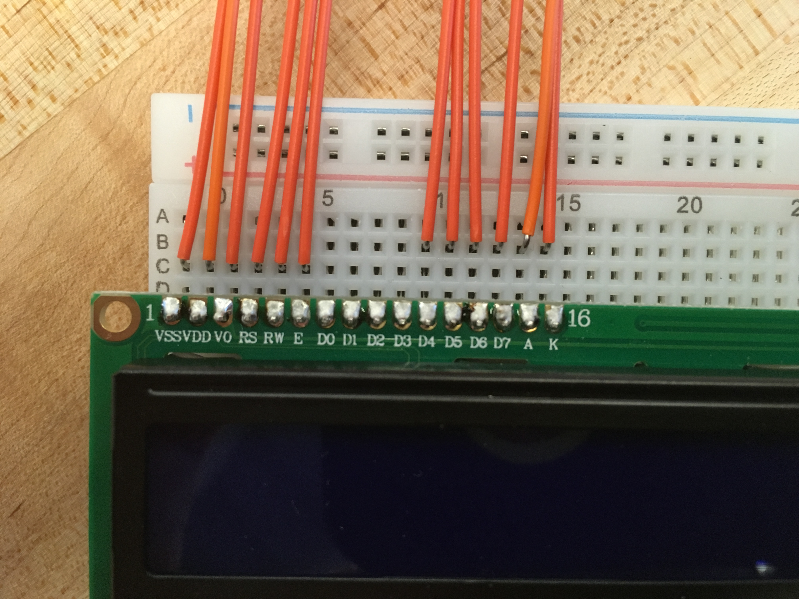

# Make a Digital Timer!
 
## Overview
For this assignment, you are going to 

A) [Solder your LCD panel](#part-a-solder-your-lcd-panel)

B) [Write text to an LCD Panel](#part-b-writing-to-the-lcd) 

c) [Using a time-based digital sensor!](#part-c-using-a-time-based-digital-sensor)

D) [Make your Arduino sing!](#part-d-make-your-arduino-sing)

E) [Make your own timer](#part-e-make-your-own-timer) 
 
## In The Report
Include your responses to the bold questions on your own fork of [this lab report template](https://github.com/FAR-Lab/IDD-Fa18-Lab2). Include snippets of code that explain what you did. Deliverables are due next Tuesday. Post your lab reports as README.md pages on your GitHub, and post a link to that on your main class hub page.

## Part A. Solder your LCD panel

**Take a picture of your soldered panel and add it here!**


## Part B. Writing to the LCD
 
**a. What voltage level do you need to power your display?**
5V

**b. What voltage level do you need to power the display backlight?**
3.3V
   
**c. What was one mistake you made when wiring up the display? How did you fix it?**
My A and K display inputs were switched! 

**d. What line of code do you need to change to make it flash your name instead of "Hello World"?**

Line 24: ```lcd.print("hello, world!");```
 
**e. Include a copy of your Lowly Multimeter code in your lab write-up.**
```C++
// include the library code:
#include <LiquidCrystal.h>

// initialize the library by associating any needed LCD interface pin
// with the arduino pin number it is connected to
const int rs = 12, en = 11, d4 = 5, d5 = 4, d6 = 3, d7 = 2;
LiquidCrystal lcd(rs, en, d4, d5, d6, d7);
int delayTime = 200;


void setup() {
  // set up the LCD's number of columns and rows:
  lcd.begin(16, 2);
  
  pinMode(A0, INPUT);
  
  
}

void loop() {
  // Turn off the display:
  lcd.noDisplay();
  delay(delayTime);
  lcd.print("Pin A0: ");
  lcd.print(analogRead(A0));
  // Turn on the display:
  lcd.display();
  
  delay(delayTime);
  lcd.clear();
}
``` 

## Part C. Using a time-based digital sensor

**Upload a video of your working rotary encoder here.**

https://drive.google.com/open?id=10K9AAW1LvEJgv6-WacTHwHROnOxNN1G-


## Part D. Make your Arduino sing!

**a. How would you change the code to make the song play twice as fast?**

Change the note durations array:

```C++
int numNotes = sizeof(melody) / sizeof(int);
for (int i = 0; i < numNotes; i++) {
    noteDurations[i] *= 2;
}
```
 
**b. What song is playing?**


## Part E. Make your own timer

**a. Make a short video showing how your timer works, and what happens when time is up!**

https://drive.google.com/file/d/1BimWCkymkOPo3-4JoSVIu3ZoUdGMYkMI/view?usp=sharing

**b. Post a link to the completed lab report your class hub GitHub repo.**
